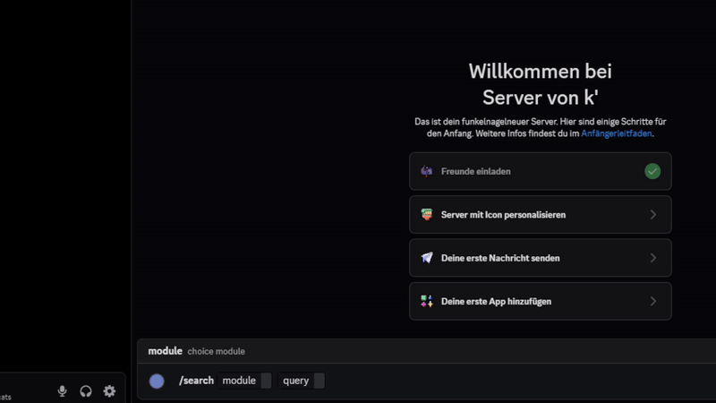

# 🔍 [ OsintCAT] Python Discord Bot Example

Osintcat.ru python bot example for premium users



## 🚀 Quick Setup

1. **Install**
   ```bash
   pip install py-cord osintcat
   ```

2. **Configure the bot**
   Edit `main.py` and replace:
   ```python
   tkn = "bot tkn"
   catid = "CatID / LoginID"
   ```

3. **Run**
   ```bash
   python main.py
   ```

## 🎯 Usage

```
/search module:email-osint query:target@example.com
```

**Available modules:** `breach` • `email-osint` • `discord`

Results are automatically saved and sent as json files.

## 🔑 Requirements

- Discord Bot Token ([Get one here](https://discord.com/developers/applications))
- osintcat Account with premium ([Sign up here](https://osintcat.ru))